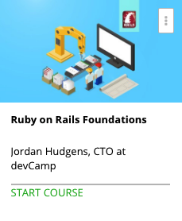

```
Roberto Nogueira  
BSd EE, MSd CE
Solution Integrator Experienced - Certified by Ericsson
```
# Ruby on Rails Foundations



**About This Course**

An in depth tutorial for learning the Ruby on Rails web framework, from basic principles to advanced coding techniques.

## Topics
```
Section: 1
Introduction and Installing Rails
[x] 1. What is Ruby on Rails? 4:09
[x] 2. How to Install Rails on a PC 5:32
[x] 3. How to Install Rails on a Mac 9:21
[x] Quiz 1: Rails Introduction Quiz 0:00

Section: 2
Building your first Rails Application
[x] 4. How to Create a Ruby on Rails Application 1:46
[x] 5. Explore the Different Rails App Creation Options 4:44
[x] 6. How to Run the Rails Server and View it in the Browser 3:28
[x] 7. Explore the List of Database Rake Tasks 6:53
[x] 8. How to Use Sublime Text as a Text Editor in Rails 4:11
[x] 9. Exploring the File System of a Ruby on Rails Application - Part 1 7:45
[x] 10. Exploring the File System of a Ruby on Rails Application - Part 2 12:52
[x] 11. Should you Use Scaffolds or Generators? 6:15
[x] 12. Creating Your First Rails Scaffold 7:27
[x] 13. Reviewing What Scaffolds Create 18:08
[x] Quiz 2: Quiz on Building Your First Rails Application 0:00

Section: 3
Rails Console
[x] 14. Introduction to the Rails Console 4:06
[x] 15. How to Create Records in the Rails Console 5:47
[x] 16. How to Update and Delete Records in the Rails Console 4:25
[x] 17. Advanced Database Queries in the Rails Console 10:02
[x] Quiz 3: Rails Console Quiz 0:00

Section: 4
Routing in Rails
[x] 18. Introduction to Routes in Ruby on Rails 1:53
[x] 19. RESTful Routing in Rails 7:09
[x] 20. How to Create a Custom Controller in Rails 2:25
[x] 21. How to Create Custom Routes for Non CRUD Pages 3:56
[x] 22. How to Set the Homepage for a Rails Application 7:28
[x] 23. How to Integrate Routing Redirects in Rails 6:02
[x] Quiz 4: Rails Routing Quiz 0:00

Section: 5
Configuring Views
[ ] 24. Overview of the Master Application Layout File 3:52
[ ] 25. How to Use View Partials 5:57
[ ] 26. Advanced ERB Tips 8:59
[ ] 27. How to Integrate Images into a Rails Application 3:13
[ ] 28. How to Integrate Custom CSS Styles Using the Rails Asset Pipeline 6:26
[ ] 29. Integrating Web Safe Fonts into a Rails Application 3:09
[ ] 30. How to Integrate a Custom Font into a Rails Application 8:00
[ ] Quiz 5: Rails Views Quiz 0:00

Section: 6
Rails Controllers
[ ] 31. Purpose of Controllers in Rails 7:23
[ ] 32. Learn What Methods in Controllers Do 8:18
[ ] 33. Stay Away from These Controller Antipatterns 4:28
[ ] 34. Integrating Custom Queries in Rails Controllers 5:57
[ ] Quiz 6: Rails Controllers Quiz 0:00

Section: 7
Rails Models
[ ] 35. Purpose of Models in Rails 3:23
[ ] 36. Creating Custom Model Files for Algorithm Integration 6:21
[ ] 37. How to Integrate Custom Database Scopes in a Rails Model File 4:35
[ ] 38. Using Model Files to Create Database Column Default Values 6:31
[ ] 39. How to Integrate Validations in Rails with Model Files 2:33
[ ] 40. How to Generate a Model in Rails 4:08
[ ] 41. Setting Up Database Relations in a Model File 3:13
[ ] 42. How to Add a New Column to a Database Using Migrations 3:40
[ ] 43. Integrating Advanced Callbacks Using a Rails Model File 10:05
[ ] Quiz 7: Rails Models Quiz 0:00

Section: 8
Rails Database Management
[ ] 44. Review on Creating Columns in a Database Table 1:39
[ ] 45. How to Change the Data Type of a Column in Rails 3:16
[ ] 46. How to Remove a Column in Rails with a Migration 1:25
[ ] Quiz 8: Rails Database Management Quiz 0:00

Section: 9
Ruby Gems and Advanced Development Features
[ ] 47. What are Ruby Gems? 3:10
[ ] 48. How to Add Gems to an App's Gemfile 2:18
[ ] 49. Securing Application Credentials 4:53
[ ] 50. How to Build Out a File Uploader in Rails with Carrierwave 3:23
[ ] 51. Connecting to the AWS API 1:56
[ ] 52. How to Generate a Controller in Rails 3:23
[ ] 53. Manually Integrating CRUD Functionality Into a Rails Controller 8:32
[ ] 54. How to Add Private Methods to a Rails Controller 4:10
[ ] 55. Creating Nested Routes in a Rails Application 5:37
[ ] 56. Setting Up a Nested Form in Rails 2:17
[ ] 57. Integrating Parent Values in a Nested Resource Controller Method 3:52
[ ] 58. Configuring Custom Redirects for Nested Resources 2:44
[ ] 59. Integrating Arguments Into Links in Rails 4:51
[ ] 60. Integrating Multiple Queries on a Single Page in Rails 4:12
[ ] 61. Integrating Conditionals Into View Pages for Custom Page Behavior 11:33
[ ] 62. Finalizing File Uploads and Performing Advanced Debugging 8:03
[ ] Quiz 9: Ruby Gems and Advanced Development Features Quiz 0:00

Section: 10
Authentication
[ ] 63. Installing the Devise Gem for Authentication 6:54
[ ] 64. Creating a Devise User Model in Rails 3:57
[ ] 65. Testing Registration and Signing Into a Rails Application in the Browser 3:10
[ ] 66. Integrating the current_user Method into a Rails App 3:32
[ ] 67. How to Allow User to Edit Account Info in Rails 4:05
[ ] Quiz 10: Authentication Quiz 0:00

Section: 11
Deploying a Rails Application
[ ] 68. Overview of Rails Deployment Options 3:28
[ ] 69. Heroku Deployment Requirements 1:57
[ ] 70. Integrating git to a Rails Application and Pushing to GitHub 6:42
[ ] 71. Deploying to Heroku 17:35
[ ] 72. Accessing the Rails Console on Heroku 1:48
[ ] Quiz 11: Rails Deployment Quiz 0:00

Section: 12
Summary
[ ] 73. Course Summary 1:38
[ ] Quiz 12: Final Quiz 0:00
```


